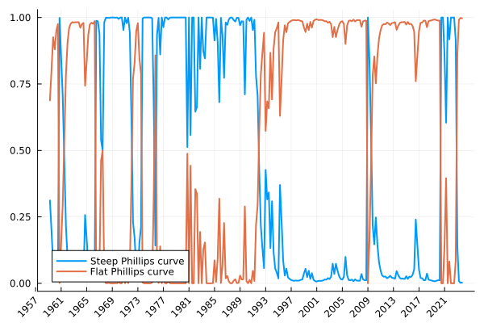

# Regime switching Phillips curve

One of the most popular macroeconomic relationships is the trade-off between inflation and unemployment. The so-called Phillips curve is discussed in both introductory macroeconomics courses and at the meetings of the most influential central banks. The curve is an empirical observation which introduced a stylized fact that the inflation falls during recessions and rises during booms.

However, many policymakers and academic economists have argued that the historical relationship has changed over time. The 'flattening' of the Phillips curve poses a challenge for policymakers, as it can imply that countercyclical policy may not be effective in steering inflation toward the established central bank's target.

To investigate the time-varying nature of the Phillips curve, we will estimate a Markov switching model.

First we would need a dataset with quarterly inflation and unemployment. We will use the data from the Federal Reserve Bank of St. Louis (FRED) database. The data is available in the repository of the package.

```jldoctest phillips
using MarSwitching
using DataFrames
using CSV
using Plots
using Random
using Dates

df = CSV.read("my_assets/philips.csv", DataFrame, missingstring = "NA")

model_df = dropmissing(select(df, [:cpi, :unemp,  :infexp, :s_shock]))  
```

Let's see how the relationship looks like in the raw data:

```jldoctest
using Plots

plot_df = filter(x -> x.cpi .> -2, model_df) # remove outliers

phil_plot = plot(plot_df.unemp, plot_df.cpi,
                seriestype=:scatter, legend = :none,
                title = "Phillips curve",
                xlabel = "Unemployment rate gap", ylabel = "CPI change")
```


Overall, the relationship is far from being clear. The slope of plotted data is just slightly negative. 

```jldoctest
x = [ones(size(model_df)[1]) model_df.unemp]
(x'x)^(-1)*(x'model_df.cpi)
```
```jldoctest
2-element Vector{Float64}:
  0.926584897227734
 -0.0024658207247481023
```

However, as it often the case, simply plotting scatterplots falls short when trying to find evidence of more complex phenomena. 

Now, how can theory guide our model specification? The developments in New Keynesian economic theory, provides a model where: 

- Inflation is sticky, i.e. it does not adjust immediately to changes in the economy. This might be because of the rigid contracts between firms and workers, or because of the inertia in the price setting process.

- Inflation expectations matter. The economic agents keep in mind the inflation target of the central bank or the past inflation when setting prices.

Both of the reasons above suggests the use of another variable, namely moving average of past 4 quarters of inflation. Altough obvious from purely econometric point of view, addition of this variable is well grounded in theory. 

```jldoctest
3-element Vector{Float64}:
  0.6142244973354851
 -0.07542670572276094
  0.2057396961885335
```

Indeed, once we add the inflation expectations, the slope of the New Keynesian Phillips curve becomes slightly more negative. It is still far from what we would expect from the theory, but it is a step in the right direction.

Now, in order to check the time-varying nature of the Phillips curve, or the so-called "flattening" of thereof, we will estimate a Markov switching model. The set of variables will also be extended to include a proxy for the supply shock, which will be a difference between core and headline inflation. This variable might be relevant as we might expect some changes in e.g. prices of commodities on global market to have a material impact on the inflation. At the same time being unrelated to the domestic economic conditions and the phenomena we would like to describe. 

```jldoctest
Random.seed!(0)
model = MSModel(model_df.cpi, 2, 
                exog_switching_vars = [model_df.unemp model_df.infexp],
                exog_vars =  model_df.s_shock)

summary_msm(model)
```
```jldoctest
Markov Switching Model with 2 regimes
=================================================================
# of observations:          259 AIC:                       108.149
# of estimated parameters:   11 BIC:                       147.274
Error distribution:    Gaussian Instant. adj. R^2:          0.7311
Loglikelihood:            -43.1 Step-ahead adj. R^2:        0.7308
-----------------------------------------------------------------
------------------------------
Summary of regime 1:
------------------------------
Coefficient  |  Estimate  |  Std. Error  |  z value  |  Pr(>|z|)
-------------------------------------------------------------------
β_0          |     1.092  |       0.191  |    5.724  |    < 1e-3  
β_1          |    -0.129  |        0.03  |   -4.261  |    < 1e-3  
β_2          |     0.207  |       0.019  |    10.89  |    < 1e-3
β_3          |     0.232  |       0.008  |   28.674  |    < 1e-3
σ            |     0.505  |       0.025  |   20.303  |    < 1e-3
-------------------------------------------------------------------
Expected regime duration: 18.28 periods
-------------------------------------------------------------------
------------------------------
Summary of regime 2:
------------------------------
Coefficient  |  Estimate  |  Std. Error  |  z value  |  Pr(>|z|)
-------------------------------------------------------------------
β_0          |     0.337  |       0.065  |    5.223  |    < 1e-3  
β_1          |    -0.009  |       0.009  |   -0.987  |     0.324  
β_2          |     0.111  |       0.012  |    9.531  |    < 1e-3
β_3          |     0.232  |       0.008  |   28.674  |    < 1e-3
σ            |     0.151  |       0.012  |   12.384  |    < 1e-3
-------------------------------------------------------------------
Expected regime duration: 27.25 periods
-------------------------------------------------------------------
left-stochastic transition matrix:
          | regime 1   | regime 2
---------------------------------------
 regime 1 |   94.528%  |    3.669%  |
 regime 2 |    5.472%  |   96.331%  |
```

The model shows that there are 2 regimes of the cyclical relationship. The second regime is characterized by significantly negative slope of the Phillips curve. This is a regime, which should allow policy makers to have some influence on the inflation. The second regime is characterized by a very flat Phillips curve, as the coefficient for unemployment is not significantly different than zero. The inflation during this regime is also substantially less volatile than otherwise. 

Unfortunately for policy makers, the average duration of the favorable regime is ~18 quarters, while the flat Phillips curve is the dominant regime with the average duration of ~27 quarters.

```jldoctest
plot(df.date[9:end], 
    [filtered_probs(model)[:,1] filtered_probs(model)[:,2]],
    xticks = (Date.(minimum(year.(df.date)):4:maximum(year.(df.date))),minimum(year.(df.date)):4:maximum(year.(df.date))),
    xrotation= 45,
    label     = ["Steep Phillips curve" "Flat Phillips curve"],
    linewidth = 2,
    legend = :bottomleft)
```


The plot above shows the probability of being in particular regime. The model confirms some of the concerns among economists regarding the "flattening" of the Phillips curve. Indeed, the period when Phillips curve behave as expected by the theory has changed at the beginnning of 1990. Since then, the ability of policymakers to influence the inflation has been substantially reduced. 

