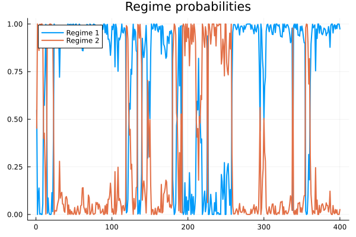

# Getting started

Following example will estimate a simple Markov switching model with regime dependent intercept, exogenous variable and variance. The model is defined as follows:

```math
\begin{align*}
    y_t &= \mu_s + \beta_s x_t + \epsilon_t, & \epsilon &\sim \mathbb{N}(0,\mathcal{\Sigma}_s) \\
\end{align*}
```
```math
\begin{equation*}
    P(S_t = i | S_{t-1} = j) = \begin{bmatrix}
        p_1 & 1 - p_2\\
        1 - p_1 & p_2
        \end{bmatrix}
\end{equation*}
```

```@example
using MarSwitching
using Random
using Statistics

k = 2            # number of regimes
T = 400          # number of generated observations
μ = [1.0, -0.5]  # regime-switching intercepts
β = [-1.5, 0.0]  # regime-switching coefficient for β
σ = [1.1,  0.8]  # regime-switching standard deviation
P = [0.9 0.05    # transition matrix (left-stochastic)
     0.1 0.95]

Random.seed!(123)

# generate artificial data with given parameters
y, s_t, X = generate_msm(μ, σ, P, T, β = β) 

# estimate the model
model = MSModel(y, k, intercept = "switching", exog_switching_vars = X[:,2])

# we may simulated data also from estimated model
# e.g. for calculating VaR:
quantile(generate_msm(model, 1000)[1], 0.05)

# or more interestingly, output summary table
summary_msm(model)
```

The estimated model has a following form:

```math
y_t = 
\begin{cases}
    0.82 - 1.48 \times x_t + \epsilon_{1,t} ,& \epsilon_1 &\sim \mathbb{N}(0,1.12), & \text{for } S_t = 1\\
    -0.51 - 0.003 \times x_t + \epsilon_{2,t} ,& \epsilon_2 &\sim \mathbb{N}(0,0.84), & \text{for } S_t = 2
\end{cases}
```

```math
\begin{equation*}
    P(S_t = i | S_{t-1} = j) = \begin{bmatrix}
        91.18\% & 3.5\% \\
        8.82\% & 96.5\%
        \end{bmatrix}
\end{equation*}
```

The package also provides functions for filtered transition probabilities $P(S_t = i | \Psi_t)$, as well as smoothed ones $P(S_t = i | \Psi_T)$. Essentially, the difference is that in order to calculate the smoothed probabilities the whole sample is used.

```julia
using Plots

plot(filtered_probs(model),
     label     = ["Regime 1" "Regime 2"],
     title     = "Regime probabilities", 
     linewidth = 2)
```     


```julia
using Plots

plot(smoothed_probs(model),
     label     = ["Regime 1" "Regime 2"],
     title     = "Smoothed regime probabilities", 
     linewidth = 2)
```     

